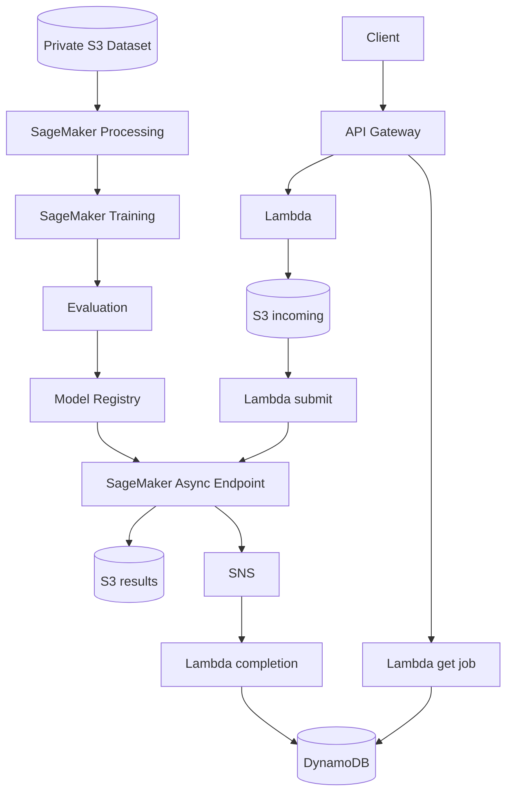

# OtoSage-AWS

[](https://github.com/singhankitsrf/OtoSage_AWS_GitHub/actions/workflows/ci.yml)  

### AWS-Native Event-Driven Healthcare AI Platform for Otoscopic Image Analysis

**Amazon SageMaker Pipelines • Model Registry • Asynchronous Inference • S3 • Lambda • API Gateway • DynamoDB • SNS • CloudWatch • Terraform • GitHub Actions OIDC**

> **Research and engineering portfolio project — not a medical device and not intended for autonomous clinical diagnosis or treatment.**

## Why this repository exists

OtoSage-AWS demonstrates how a medical-vision workload can move through a complete AWS lifecycle: data ingestion, leakage-aware preprocessing, managed training, evaluation, governed model promotion, asynchronous inference, event-driven job tracking, observability, infrastructure-as-code, and CI/CD.

## Architecture



## Repository structure

```text
app/lambdas/            # event-driven API and job lifecycle
ml/pipeline/            # SageMaker Pipeline definition
ml/src/                 # preprocess, train, evaluate, inference
deployment/             # async endpoint + autoscaling
infra/terraform/        # AWS infrastructure as code
scripts/                # upload, pipeline, demo invocation
tests/                  # unit tests
docs/                   # architecture and account deployment notes
.github/workflows/      # CI and OIDC deployment
```

## Data integrity

The project is based on a 3,000-image otoscopic archive spanning five classes. The preprocessing workflow computes SHA-256 hashes, detects exact duplicates, hard-fails on cross-label exact duplicates, keeps one canonical copy, and creates deterministic stratified splits before training.

## ML lifecycle

- SageMaker Processing for QA, duplicate control, and splits
- EfficientNetV2-S transfer learning
- accuracy, balanced accuracy, macro-F1, ROC-AUC, ECE, and Brier evaluation
- configurable engineering quality gate
- Model Registry with manual approval before deployment

## Serving workflow

1. `POST /upload` returns a pre-signed S3 URL.
2. Client uploads directly to S3.
3. S3 event submits asynchronous SageMaker inference.
4. SageMaker emits success/failure notifications through SNS.
5. Lambda updates DynamoDB job state.
6. `GET /jobs/{job_id}` returns status and an expiring result URL when complete.

## Quick start

```bash
python -m venv .venv
source .venv/bin/activate
pip install -e ".[dev,aws]"
pytest -q
ruff check .
```

## Terraform

```bash
cd infra/terraform
terraform init
terraform fmt -recursive
terraform validate
terraform plan
```

## SageMaker Pipeline

```bash
export AWS_REGION=us-east-1
export DATA_BUCKET=YOUR_DATASET_BUCKET
export SAGEMAKER_ROLE_ARN=YOUR_SAGEMAKER_ROLE_ARN
python scripts/create_pipeline.py
```

## Responsible use

This repository is an engineering/research portfolio implementation. It is not evidence of clinical validation, regulatory clearance, or suitability for autonomous diagnosis or treatment.

## Author

**Ankit Kumar Singh**

Healthcare AI • AWS • SageMaker • Applied AI • Medical Imaging • MLOps • Cloud Architecture

## Hugging Face deployment and evaluation

See [deployment instructions](docs/HUGGING_FACE.md) and the `hf_space/` application.
The `evaluation/` directory distinguishes measured results from pending image-model evaluation.

## Project management

- **Project charter:** [`PROJECT.md`](PROJECT.md)
- **Live execution roadmap:** [Project Roadmap #3](https://github.com/singhankitsrf/OtoSage_AWS_GitHub/issues/3)
- **Portfolio index:** [Five flagship GitHub projects](https://github.com/singhankitsrf/AgentForge-Enterprise-Agentic-RAG/blob/main/PORTFOLIO_PROJECTS.md)
